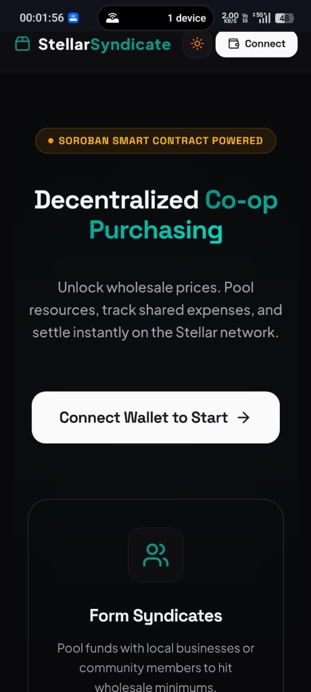
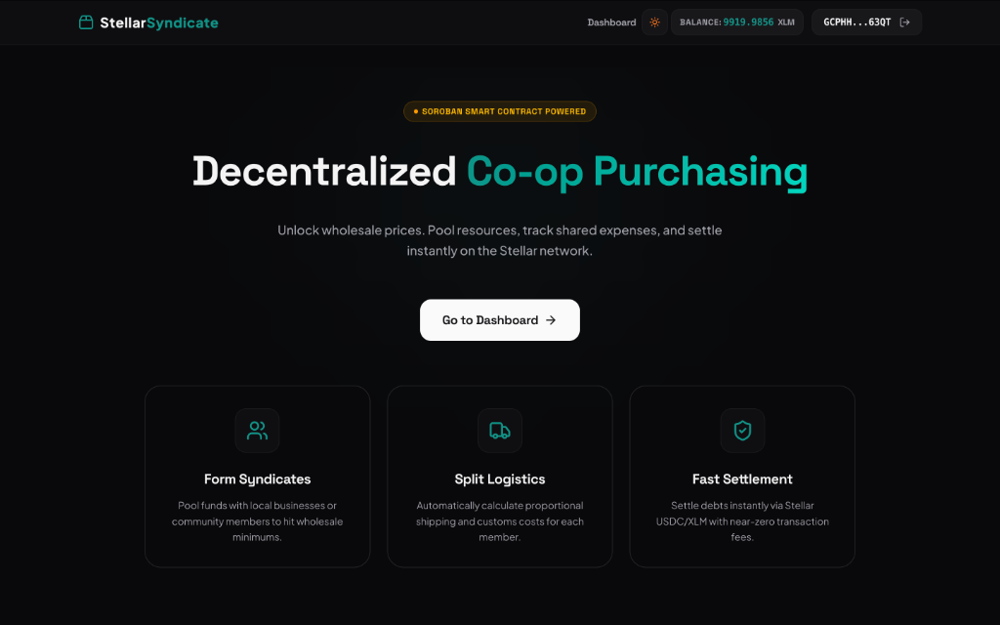
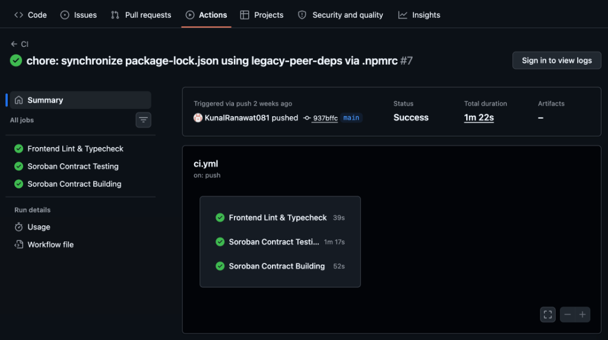
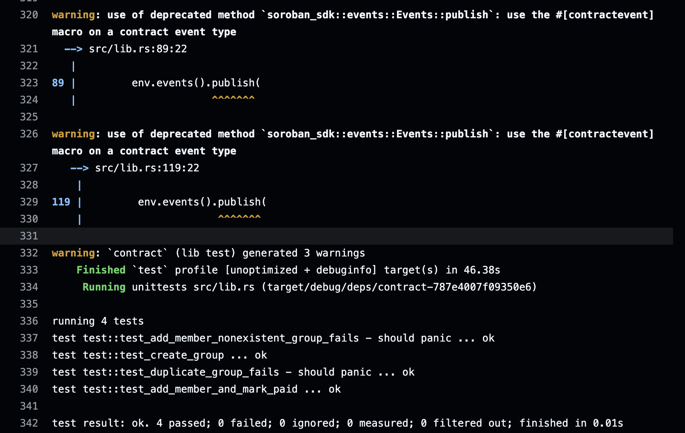

# StellarSyndicate

StellarSyndicate is a decentralized bulk-buy and co-op purchasing application designed to help small businesses and communities pool resources to access wholesale prices, leveraging the Stellar network for fast, low-cost settlements.

## Live Demo & Contracts
* **Live Demo URL:** [https://stellarsyndicate-main.vercel.app](https://stellarsyndicate-main.vercel.app)
* **Demo Video:** [Watch the Transaction Demo](./assets/demo-video.mp4)
* **Deployed Soroban Contract Address:** [CBFQ6FBVOSYZWSTXXPQVDNHR3H7LYOAQVHAHHJGMWSFUZNXZ4Z7L2GTY](https://stellar.expert/explorer/testnet/contract/CBFQ6FBVOSYZWSTXXPQVDNHR3H7LYOAQVHAHHJGMWSFUZNXZ4Z7L2GTY)
* **Successful Contract Call Tx Hash:** [cebc1786fd5698036121badde80858dfe10b6c9ad8877ff1dd5559a0b527e91f](https://stellar.expert/explorer/testnet/tx/cebc1786fd5698036121badde80858dfe10b6c9ad8877ff1dd5559a0b527e91f)

---

## Features
* **Multi-Wallet Support:** Uses `StellarWalletsKit` to seamlessly connect Freighter, Albedo, and xBull wallets on the Stellar Testnet.
* **XLM Balance Tracker:** Automatically fetches and displays the connected account's XLM balance.
* **On-Chain Syndicate Registration:** Creates co-op groups, adds members, and records payment settlements directly on the Soroban smart contract.
* **Dual Payment & Settlement Flow:** Sends native XLM payments to the Lead Buyer and automatically writes the payment confirmation status on-chain.
* **Real-time State Syncing:** Listens to contract events and polls the Stellar ledger for state changes to update the UI instantly.
* **Modern Glassmorphism UI:** Responsive dark theme optimized for desktop and mobile viewports.
* **Robust Error Handling:** Detects and guides users on wallet availability, user transaction rejection, and insufficient XLM balance.

---

## Tech Stack
* **Frontend:** React, TypeScript, Vite, Framer Motion
* **Styling:** TailwindCSS, Lucide Icons
* **Stellar Integration:** `@creit.tech/stellar-wallets-kit`, `@stellar/stellar-sdk`
* **Smart Contract Platform:** Soroban, Rust

---

## Folder Structure
```text
stellarsyndicate/
├── contract/            # Soroban Smart Contract (Rust)
│   ├── src/
│   │   └── lib.rs       # Contract implementation (LumenGuildContract)
│   └── Cargo.toml
├── src/
│   ├── components/      # UI Components (Layout, Navbar, LoadingOverlay)
│   ├── context/         # React Context (WalletContext with StellarWalletsKit)
│   ├── hooks/           # Custom hooks (useGroups)
│   ├── pages/           # Views (LandingPage, Dashboard, CreateGroup, GroupDetails)
│   ├── types/           # TS Interfaces
│   ├── utils/           # Helper functions (settlement, soroban RPC helper)
│   ├── App.tsx
│   └── main.tsx
├── package.json
└── README.md
```

---

## Setup Instructions

1. **Clone and Install Dependencies:**
   ```bash
   git clone https://github.com/placeholder-username/stellar-syndicate.git
   cd stellarsyndicate
   npm install
   ```

2. **Run Development Server:**
   ```bash
   npm run dev
   ```

3. **Production Build & Preview:**
   ```bash
   npm run build
   npm run preview
   ```

---

## Deployment

To compile the smart contract and deploy it on the Stellar Testnet, run the `deploy.sh` script in the root directory:

```bash
./deploy.sh <source_account_or_identity> [network]
```

Example:
```bash
./deploy.sh my_identity testnet
```

The script will automatically compile the Rust smart contract into WASM bytecode using target `wasm32v1-none` and deploy it using the Stellar CLI.

---

## Environment Variables
Create a `.env` file in the root directory:
```env
VITE_STELLAR_NETWORK=testnet
VITE_SOROBAN_RPC_URL=https://soroban-testnet.stellar.org
VITE_CONTRACT_ADDRESS=CBFQ6FBVOSYZWSTXXPQVDNHR3H7LYOAQVHAHHJGMWSFUZNXZ4Z7L2GTY
```

---

## Future Improvements
* **Milestone Escrow:** Lock member funds in the contract and release them incrementally to the Lead Buyer based on shipping milestones.
* **Volume Pricing Tiers:** Automatically adjust unit pricing as total order volume passes discount thresholds.
* **Reputation System:** Build historical scores for Lead Buyers based on successful settlements.

---

## Submission Assets

Below are the visual assets demonstrating project compliance for Level 3 - Orange Belt requirements:

### Mobile Responsive UI


### Desktop UI


### CI/CD Pipeline


### Smart Contract Test Output

